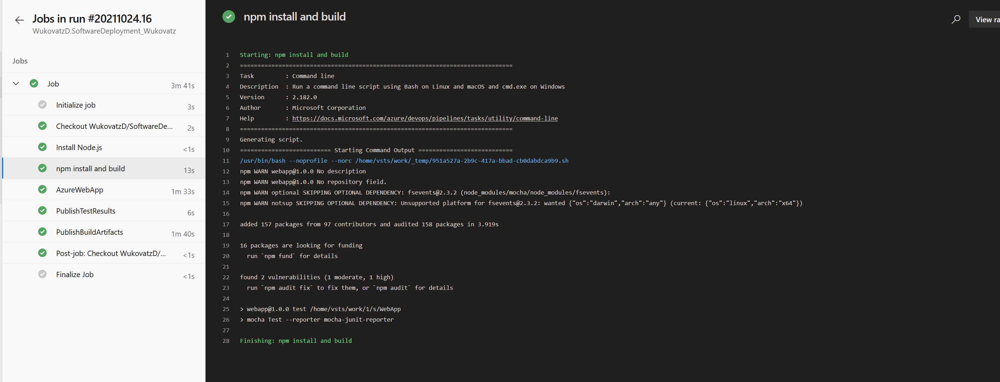
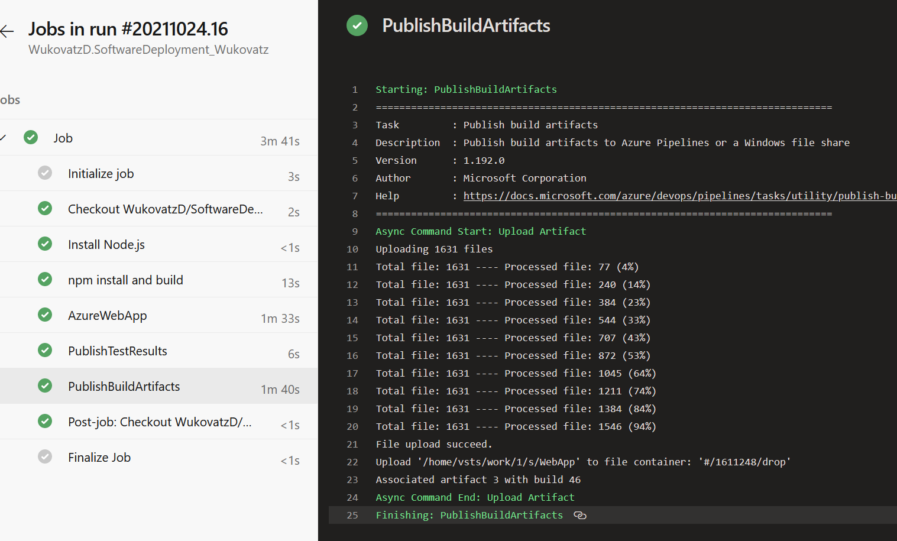
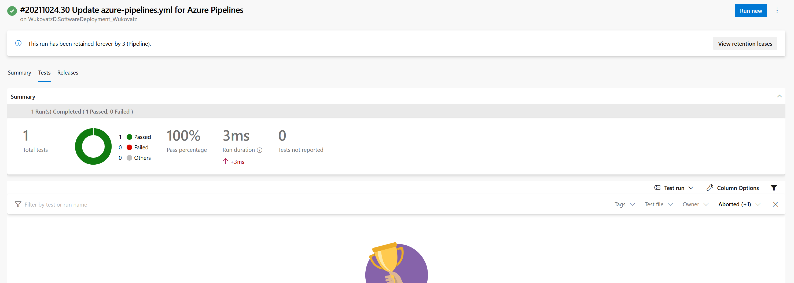
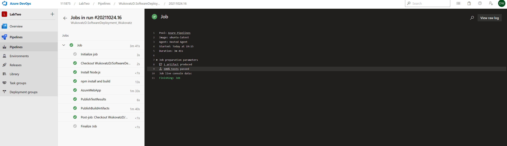
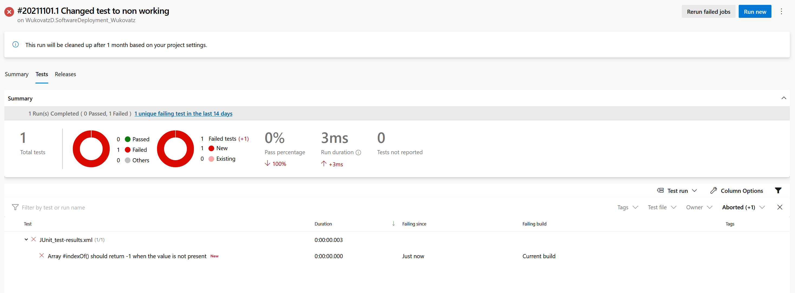
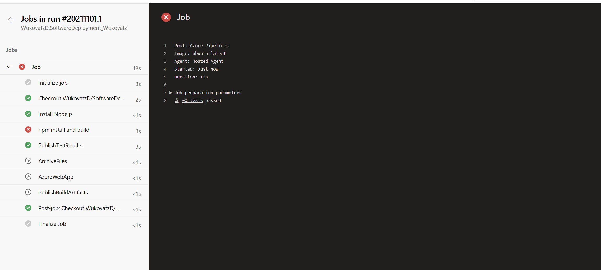
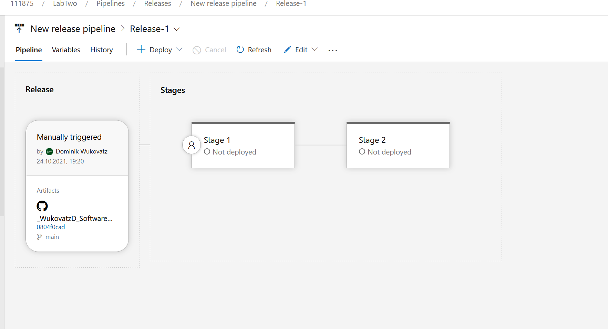
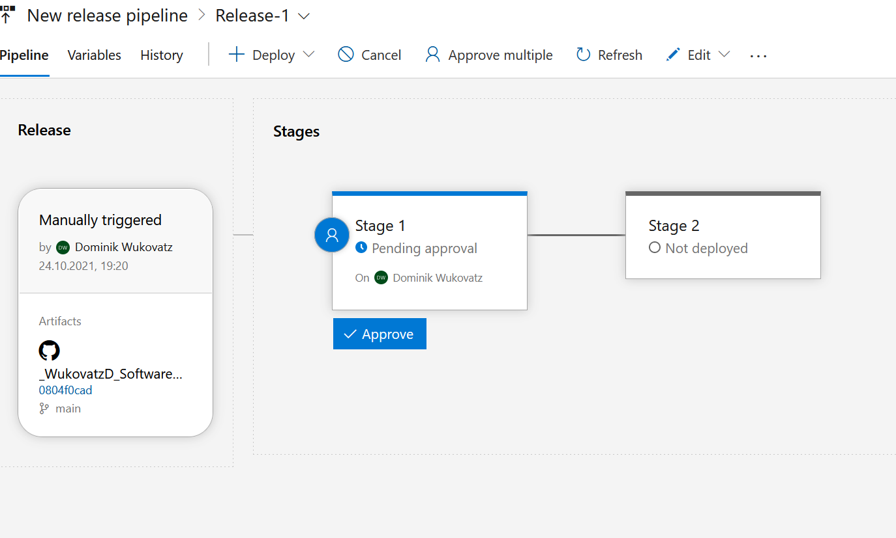
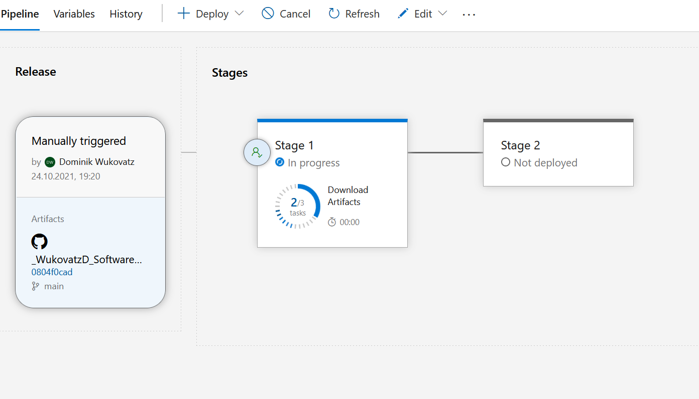
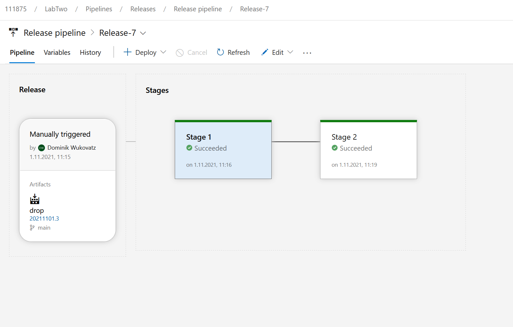

- Eine Node.JS-Anwendung wurde mit Express erstellt.

- Diese wird nach jedem gepushten Commit über eine Azure DevOps-Pipeline in einer Azure Web App bereitgestellt.

- Die Node.JS-Anwendung wurde auch mit Testfällen ausgestattet.

- Des Weiteren wurde eine Release-Pipeline erstellt, die automatisch die Übernahme eines Releases in die Produktion sicherstellt, dieses wurde mit einer manuellen Prüfung versehen, damit es nicht nach jedem Build veröffentlicht wird.

- Schließlich wurde auch Azure Application Insights integriert.

# Links

Development

- https://dominikwukovatznodeappryksmby4kranq.azurewebsites.net

Production

- https://lab2dominikwukovatznodeapp.azurewebsites.net/

# Screenshot Azure DevOps

- Summary Pipeline

  
  

- Succeeded

  
  

- Failed

  
  

# Screenshot Release Pipeline

- Release Pipeline
  
  
  
  
