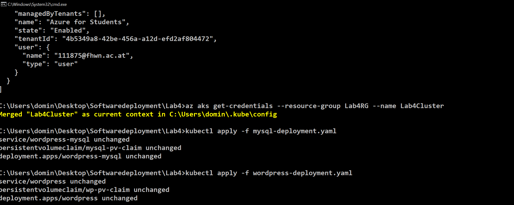
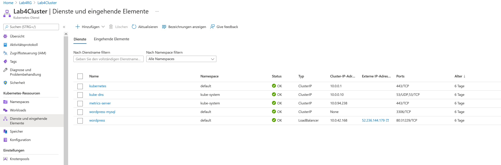

# Software Deployment - Lab 4

## YMAL File Beschreibung

## Steps to solution

Die Aufgabe war die Einrichtung und Konfiguration eines AKS in Azure sowie die Konfiguration und Bereitstellung von Wordpress und einer dazugehörigen MySQL Datenbank im Cluster.

- `az login`
- `az group create --name Lab4RG --location EuropeWest`
- `az aks create --resource-group Lab4RG --name Lab4Cluster --node-count 1 --generate-ssh-keys`

- `az aks install-cli`

- Danach sollten folgende Umgebungsvariablen bei "path" für den jeweiligen Benutzer hinzugefügt werden.

- 1. 'C:\Users\domin\.azure-kubectl'
- 2. 'C:\Users\domin\.azure-kubelogin'

- `az aks get-credentials --resource-group Lab4RG --name Lab4Cluster`
- `kubectl apply -f mysql-deployment.yaml`
- `kubectl apply -f wordpress-deployment.yaml`

## Adress

IP-Address: `http://52.236.144.179/`

## Screenshots

- ComandLine
  

- Cluster in Azure

  
